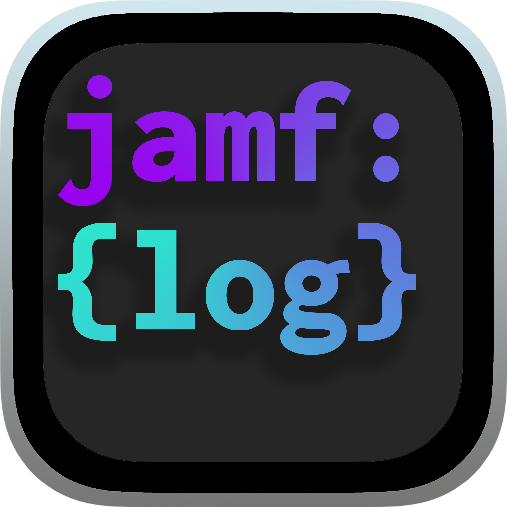
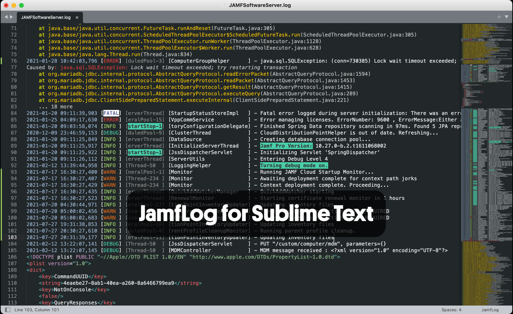
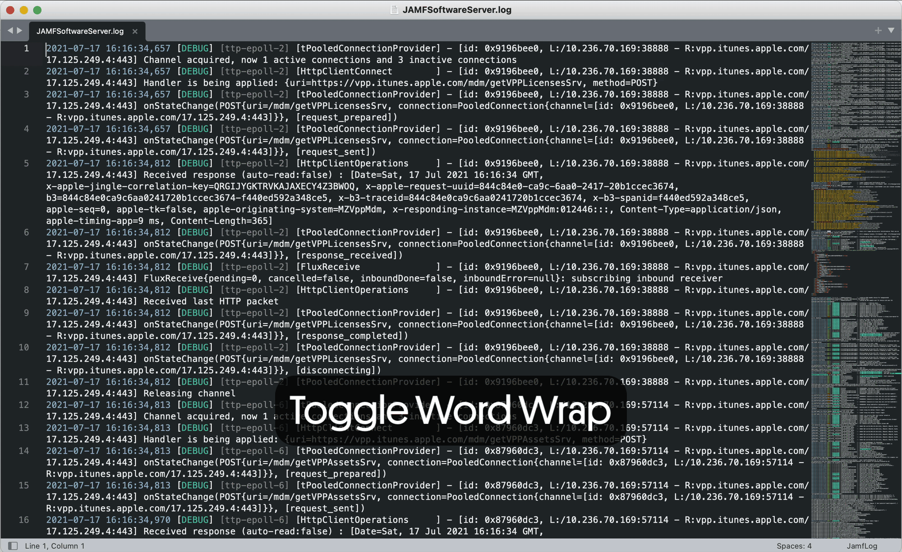

JamfLog for Sublime Text
========================

  

[Jamf Log](http://github.com/jorks/sublime-jamflog) is a [Sublime Text](http://www.sublimetext.com/) syntax highlighter for [Jamf Pro](http://jamf.com) server logs.

The plugin makes log files downloaded from a Jamf Pro server easier for humans to read!

Installation Via Package Control
------------

The recommended way to install and update this package is using [Package Control](https://packagecontrol.io/).

1. Open the Tools > Command Palette and search `Package Control: Install Package`
2. Search for `JamfLog` and install the latest version. 

#### ⚠️ ONE TIME SETUP REQUIRED ⚠️

1. Open the Tools > Command Palette.. and search `Preferences: JamfLog Settings`
2. The prefilled default settings file will open - **SAVE THIS FILE** - Done!

If you have never used package control, open the Tools > Command Palette and search `Install Package Control`

**📺 Watch JamfLog for Sublime Text - Install Instructions and Usage on YouTube 📺**

Usage Tips
----------

Sublime Text's Command Palette is your best friend - familiarise yourself with the keyboard shortcut: 

- Mac: `Cmd+Shift+P`
- Win: `Ctrl+Shift+P`

Open a `.log` file and use the Command Palette to:

- `Set Syntax: JamfLog`
- `Word Wrap: Toggle`
- `Code Folding: Fold/Unfold All` (hides all the stack traces)

License
-------

sublime-jamflog (JamfLog) is licensed under the MIT license. [LICENSE](https://raw.githubusercontent.com/jorks/sublime-jamflog/master/LICENSE)

Screenshots
-----------

**Compatibility:** JamfLog works with Sublime Text 3 & 4 for macOS, Windows and Linux with 99% of testing performed on macOS.