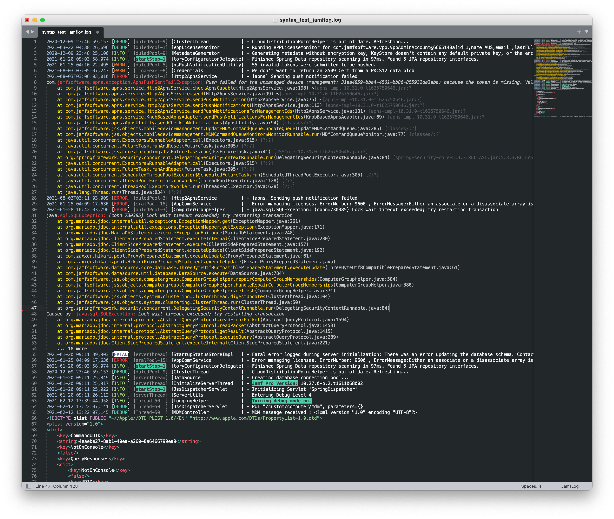

JamfLog for Sublime Text
========================

 (Coming soon)

[Jamf Log](http://github.com/jorks/sublime-jamflog) is a [Sublime Text](http://www.sublimetext.com/) syntax highlighter for [Jamf Pro](http://jamf.com) server logs.

The plugin makes log files downloaded from a Jamf Pro server easier to read for humans!

The JamfLog syntax highlighter was written specifically for `JAMFSoftwareServer.log` files downloaded from a Jamf Pro server.

Installation
------------

The recommended way to install and update this package is using [Package Control](https://packagecontrol.io/). Search for `JamfLog` and install the latest version. If you prefer to install this package manually, you can `git clone` this repo or extract the ZIP archive into your Sublime Text `Packages` folder.

JamfLog works with Sublime Text 3 & 4 for macOS, Windows and Linux with 99% of testing performed on macOS.

Usage Tips
----------

You can modify defaults in the JamfLog preferences file. Sublime Text's Command Palette is your best friend - familiarise yourself with the keyboard shortcut: 

- Mac: `Cmd+Shift+P`
- Win: `Ctrl+Shift+P`

Common commands when working with log files:

- `Set Syntax: JamfLog`
- `Word Wrap: Toggle`
- `Code Folding: Fold/Unfold All` (hides all the stack traces)

The JamfLog syntax highlighter looks for files that have the `.log` extension. This has the potential to be annoying if you work with multiple `.log` files from other software vendors. Sorry.

License
-------

sublime-jamflog is licensed under the MIT license. [LICENSE](https://raw.githubusercontent.com/jorks/sublime-jamflog/master/LICENSE)

Screenshot
----------

